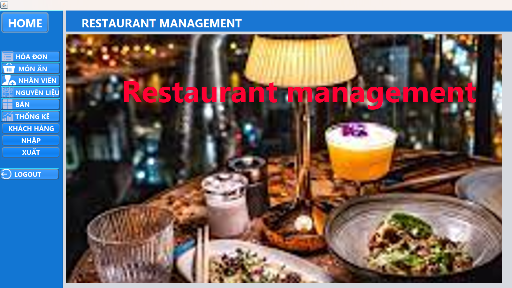
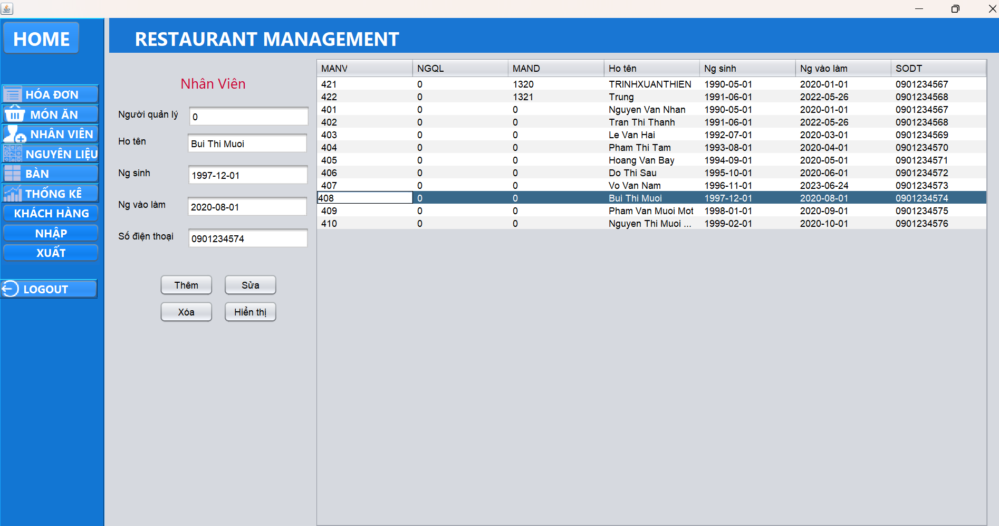
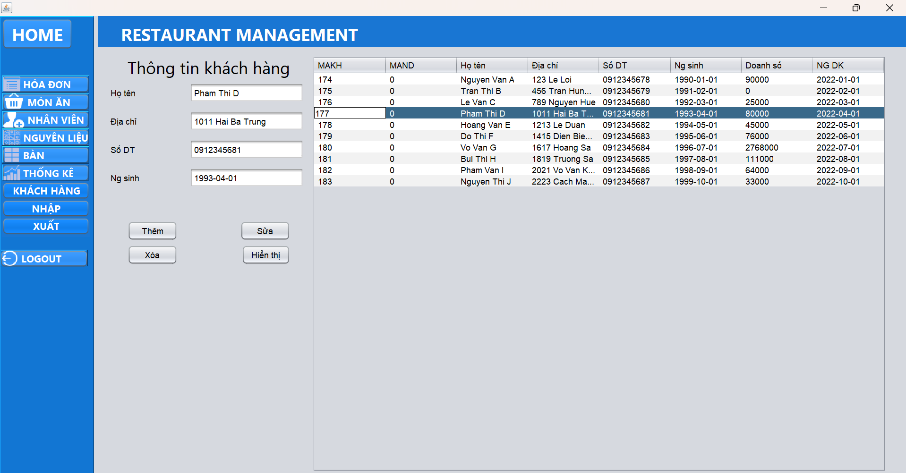
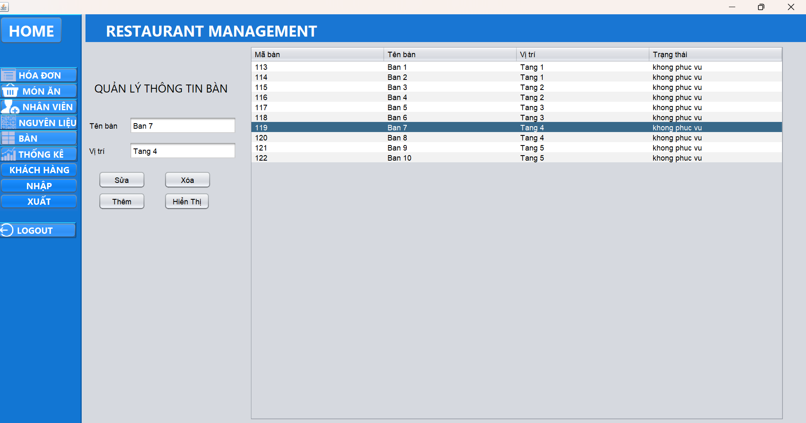
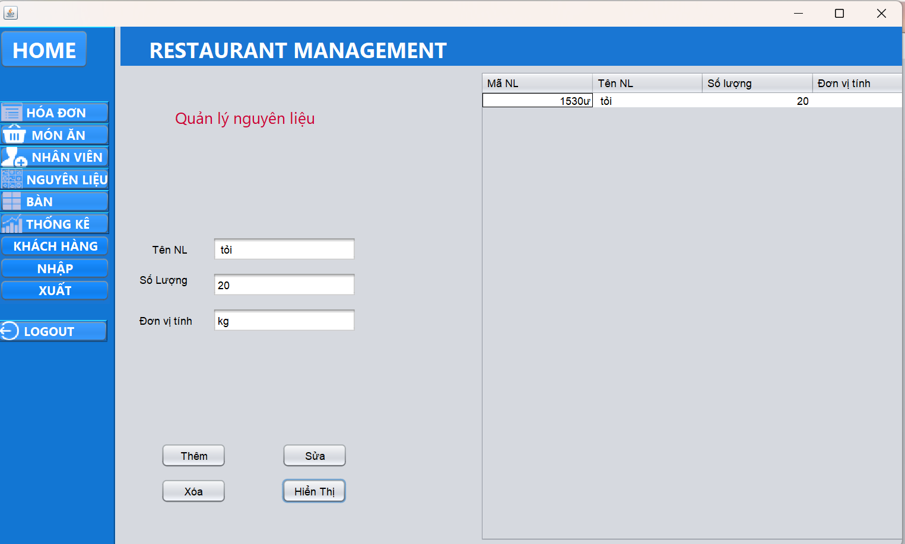
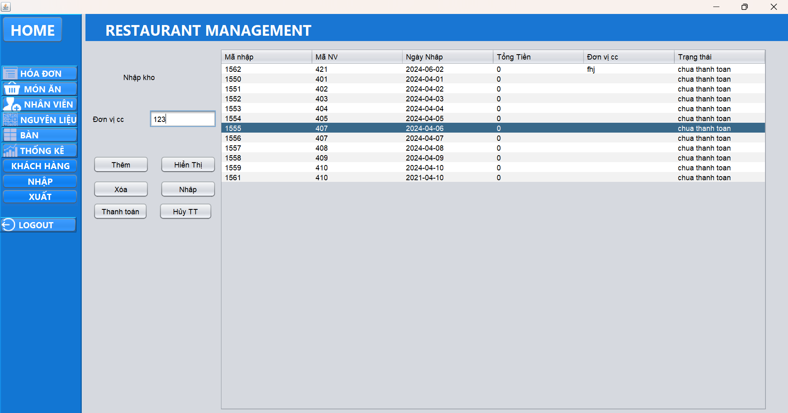
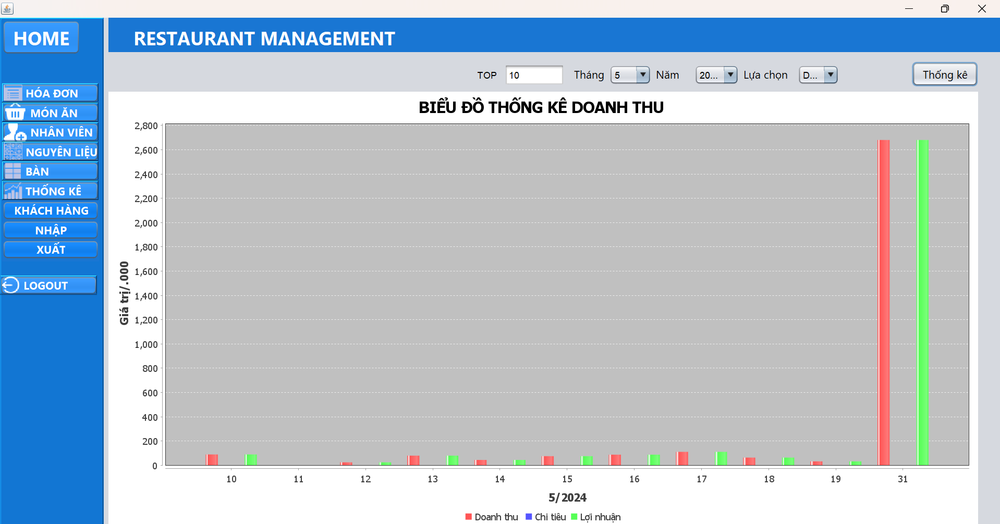

# HỆ THỐNG QUẢN LÝ NHÀ HÀNG
## Lời cảm ơn
## Giới thiệu đồ án

# Mục tiêu của đề tài
Xây dựng một hệt hống nhà hàng, gồm các chức năng quản lý nhân sự, quản lý khách hàng, quản lý kho hàng, quản lý xuất/nhập kho, quản lý menu, hóa đơn thanh toán... Xây dựng ứng dụng thân thiện với người dùng, có đủ các chức năng thống kê về doanh thu, món ăn để chủ nhà hàng có thể giám sát thuận tiện nhất.
# Nhóm thực hiện
| MSSV | Họ tên | Đánh giá|
|-------|-------|-------|
| 22521395| Trịnh Xuân Thiện | 100% |
|  | Lý Huỳnh Ngọc Trung | 100% |
| 22521395| Trịnh Xuân Thiện | 100% |
|  | Lý Huỳnh Ngọc Trung | 100% |
# Mô hình ERD

# Chức năng chính trong ứng dụng
> * Đăng nhập
> * Đăng ký tài khoản
> * Quản lý đặt bàn, thanh toán
> * Quản lý nhân viên
> * Quản lý khách hàng
> * Quản lý thực đơn
> * Quản lý kho
> * Báo cáo thông kê
# Demo sản phẩm

>* Đăng Ký

>* Đăng Nhập

>* Giao diện chính

  

>* Quản lý nhân viên

  
>* Quản lý khách hàng

  
>* Quản lý hóa đơn

  
>* Quản Lý bàn

  

>* Quản Lý Thực Đơn

  
>* Quản Lý nguyên liệu

  
>* Quản Lý nhập kho

  

>* Quản Lý xuất kho
 

>* Thống kê doanh thu

>* Thống kê món ăn

  

# Ngôn ngữ, công nghệ sử dụng
# Yêu cầu cài đặt
# Hướng dẫn cài đặt chương trình
# Tài liệu tham khảo

