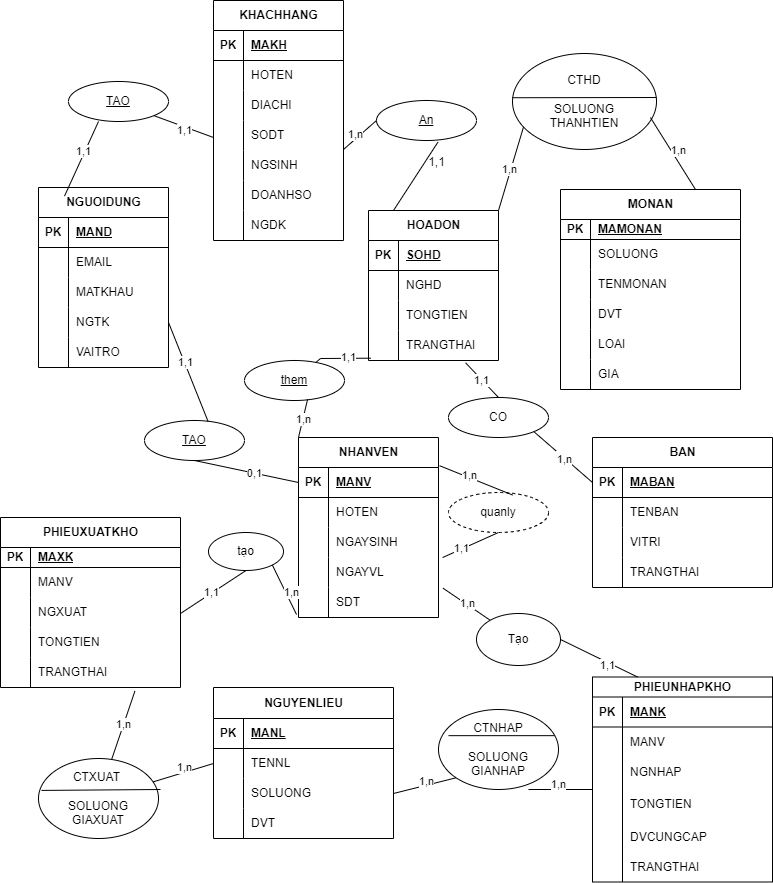
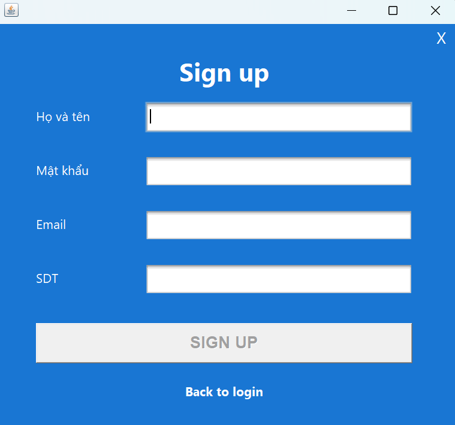
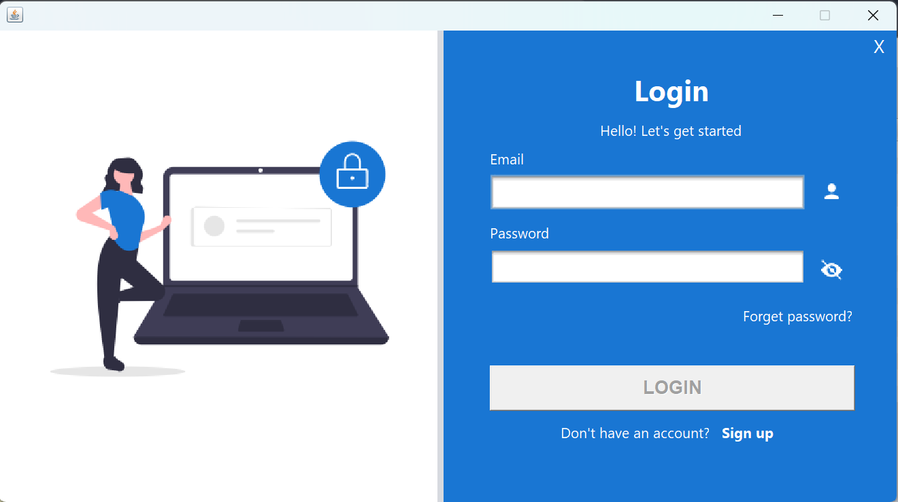
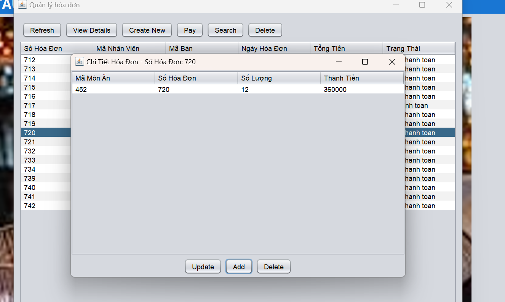
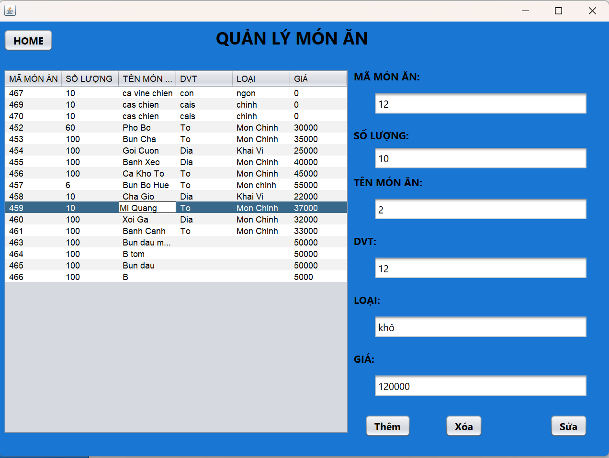
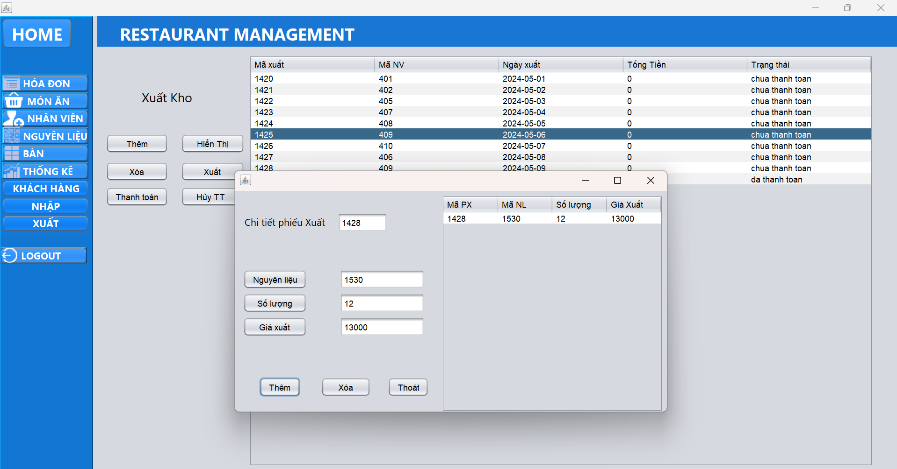
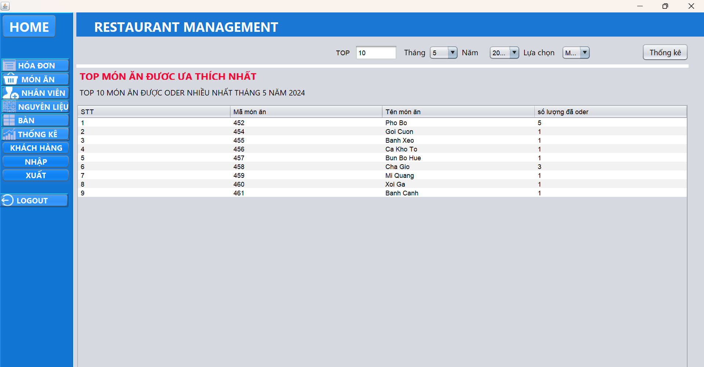

# HỆ THỐNG QUẢN LÝ NHÀ HÀNG

## Lời cảm ơn
## Giới thiệu đồ án

# Mục tiêu của đề tài
Xây dựng một hệt hống nhà hàng, gồm các chức năng quản lý nhân sự, quản lý khách hàng, quản lý kho hàng, quản lý xuất/nhập kho, quản lý menu, hóa đơn thanh toán... Xây dựng ứng dụng thân thiện với người dùng, có đủ các chức năng thống kê về doanh thu, món ăn để chủ nhà hàng có thể giám sát thuận tiện nhất.
# Nhóm sinh viên thực hiện
| MSSV | Họ tên | Đánh giá|
|-------|-------|-------|
| 22521395| Trịnh Xuân Thiện | 100% |
|  | Lý Huỳnh Ngọc Trung | 100% |
|  | Nguyễn Văn Thái Mạnh | 100% |
|  | Nguyễn Đăng Khoa | 100% |
# Mô hình ERD

# Chức năng chính trong ứng dụng
> * Đăng nhập
> * Đăng ký tài khoản
> * Quản lý đặt bàn, thanh toán
> * Quản lý nhân viên
> * Quản lý khách hàng
> * Quản lý thực đơn
> * Quản lý kho
> * Báo cáo thông kê
# Demo sản phẩm

>* Đăng Ký

>* Đăng Nhập

>* Giao diện chính

  

>* Quản lý nhân viên

  
>* Quản lý khách hàng

  
>* Quản lý hóa đơn

  
>* Quản Lý bàn

  

>* Quản Lý Thực Đơn

  
>* Quản Lý nguyên liệu

  
>* Quản Lý nhập kho

  

>* Quản Lý xuất kho
 

>* Thống kê doanh thu

>* Thống kê món ăn

  

# Ngôn ngữ, công nghệ sử dụng
>*	Ngôn ngữ sử dụng: Java
>*	Công cụ xây dựng ứng dụng: NetBeans, Visual Studio Code.
>* Công cụ lập trình giao diện: JavaSwing
>* Cơ sở dữ liệu: Oracle
>* Các thư viện hỗ trợ: javax.mail.jar, activation.jar , jfreechart.jar, jcommon-1.0.23.jar, ojdbc11.jar
>* ­Công cụ vẽ sơ đồ phân tích và thiết kế dữ liệu: StarUML, draw.io, visual paradigm

# Yêu cầu cài đặt
>* JDK 21
>* ojdbc11.jar
>* javax.mail.jar
>* activation.jar
>* jfreechart.jar
>* jcommon-1.0.23.jar
# Hướng dẫn cài đặt chương trình
>* Bước 1 : Clone project PTTKHTTT_project_HTQLNH
>* Bước 2 : Vào Netbeans chọn Open project và mở project vừa clone về
>* Bước 3 : Thêm tất cả các thư viện cần thiết trong mục src/thuvien
>* Bước 4 :Trong src/database có file database.sql. Vào oracle tạo user mới với username là doan
Và password là 123 ,sau đó chạy toàn bộ file database.sql
>* Bước 5 : Tiến hành chạy run file src/view2/Login để chạy chương trình với tài khoản : doan@gmail.com mật khẩu 123456

# Tài liệu tham khảo
- [Java UI Design - Dashboard Desktop Application](https://github.com/DJ-Raven/java-ui-dashboard-008))
- [Java_Project_RestaurantMS](https://github.com/NHViet03/Java_Project_RestaurantMS))

